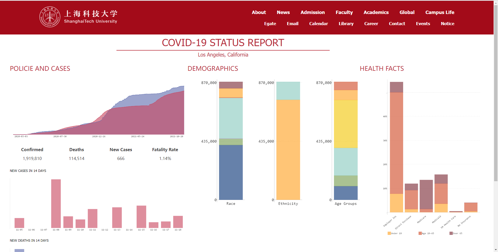

# ShanghaiTech COVID Dashboard

The ShanghaiTech COVID Dashboard is a website built as the bonus project of SI100b Introduction to Information Science and might also be used in the final project of SL1007 The Challenges of global health.  

The website backend is written in Python as is required in SI100b, and the frontend is written in vanilla JavaScript and HTML as an application of MVC model.

[](https://www.python.org/downloads/release/python-362/) [](https://www.djangoproject.com/) [](https://travis-ci.org/QingdaoU/OnlineJudge) []()

## Features

- Automatic update in every 4 hours and regenerate graphs to sync with the newest COVID-19 data in the United States.

- Heat maps of the whole nation from total cases, total deaths, new cases, new deaths and vaccine coverage.

- Detailed graphs in 7 days, 30 days, 90days and since 2020 from the aspects of total cases, total deaths, new cases and new deaths.

- Wide data coverage from counties to states, providing larger images of the COVID-19 situation.

- Specialized sub-pages for every county and state, with data in the aspects of age, race, income and insurance, as well as the vaccine situation.

- Prediction graphs using the Moving-Average Model.

- Uniformed UI design with the ShanghaiTech official website.

  

  

  
  
  


## Data Source

Our data mainly comes from Johns Hopkins University, New York Times and Center of Disease Control. Some extra data about age structure and others are provided by ACS5. 

You can find the detailed list in ./docs/raw_data.txt


## Build

- Install Docker
- Install Docker-Compose

```bash
$ git clone git@github.com:yanglinshu/covid.git
$ cd covid
$ docker-compose up -d
```
And the website will runs at localhost:12345.


## Contribution

The website is mainly finished by yanglinshu, and the prediction model is provided by zyhDuludulu.


## License

Licensed under the [MIT License](./LICENSE).

All rights reserved by yanglinshu.

